# Taller de Mantenimiento Automotriz

## Descripción
Este proyecto es una aplicación de escritorio desarrollada en **C#** con **SQL Server** para la gestión de un taller de mantenimiento automotriz. Permite el registro y seguimiento de vehículos, asignación de estados, mecánicos responsables, detalles de servicios aplicados, costos y uso de repuestos. Además, gestiona el inventario de repuestos y sus proveedores, así como los usuarios del sistema.

## Características
- **Gestión de vehículos**: 
  - Registro de vehículos con datos relevantes.
  - Asignación de estados del mantenimiento.
  - Asignación del mecánico responsable.
  - Registro de servicios aplicados y costos.
  - Control de repuestos utilizados.
  - Opción para dar de baja un vehículo.
- **Inventario de repuestos**:
  - Registro y gestión de repuestos disponibles.
  - Gestión de proveedores.
- **Usuarios del sistema**:
  - Control de acceso y gestión de roles.
- **Base de datos**: SQL Server para almacenamiento seguro y estructurado de la información.
- **Interfaz de usuario**: Aplicación de escritorio intuitiva y fácil de usar.
- **Distribución**: Ejecutable (.exe) para facilitar su uso.

## Tecnologías utilizadas
- **Lenguaje de programación**: C#
- **Base de datos**: SQL Server
- **Interfaz gráfica**: Windows Forms

## Instalación
1. Instalar **SQL Server** y configurar la base de datos.
2. Instalar dependencias: **Microsoft visual basic packs & SQL Server Integration Services Projects** 
3. Restaurar el backup de la BD (Asegurarse de agregar login del query llamado login)
4. Ejecutar el Programa (Asegurarse cambiar el servidor de conexión y usar credenciales validas)

**Credenciales registradas:** Usuario: Luisao Contraseña: luis123

## Capturas de Pantalla
### Sistema de gestión de mantenimientos y repuestos
#### Inicio de Sesión

#### Gestión de Clientes
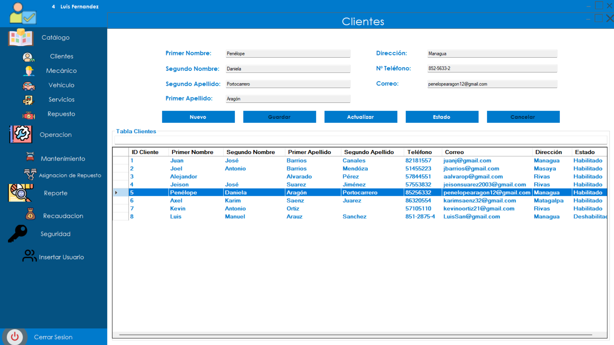
#### Gestión de repuestos
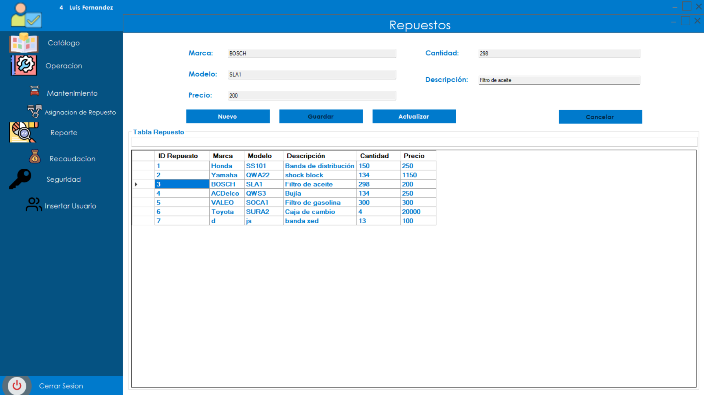
#### Gestión de Mantenimientos
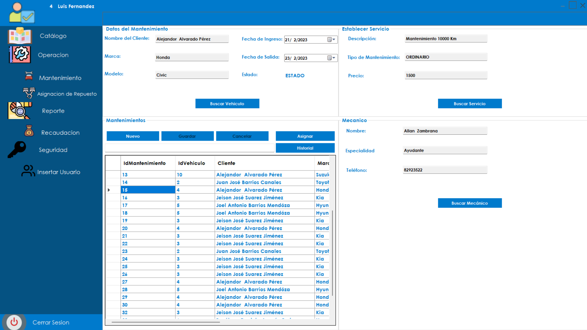

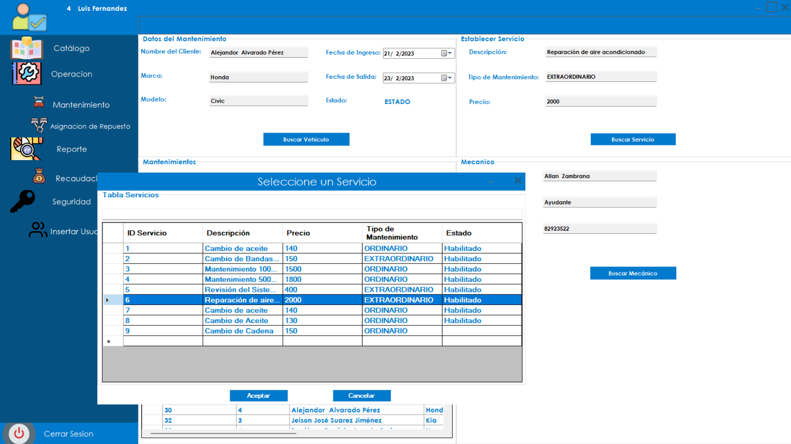

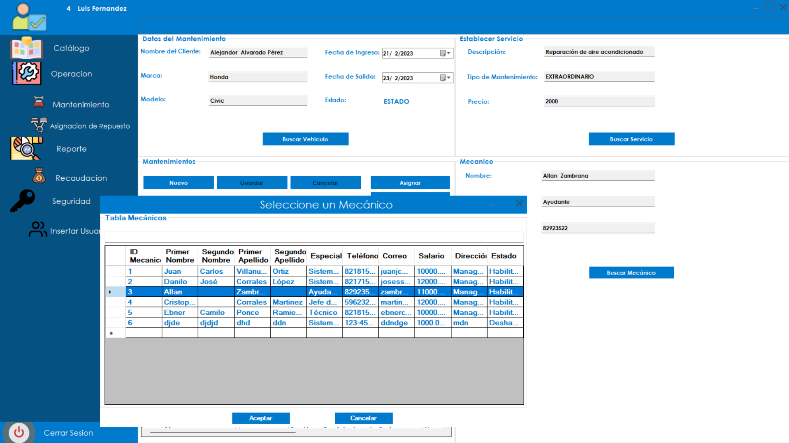

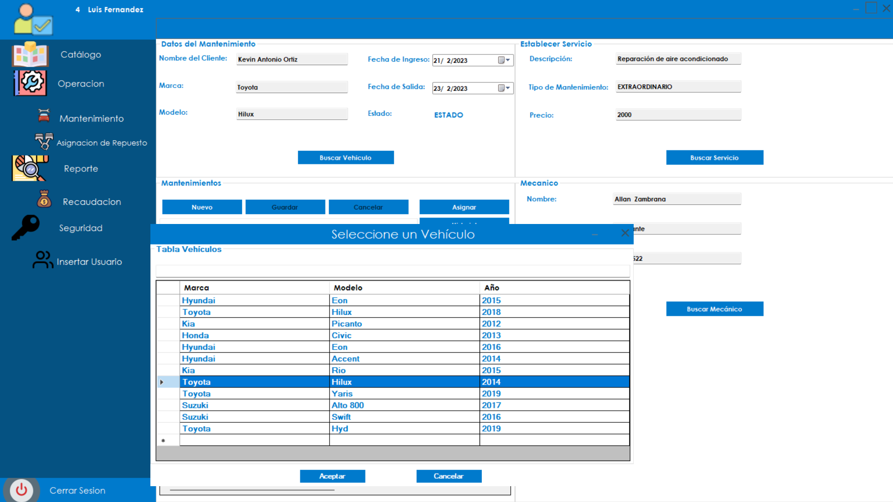
#### Asignación de repuestos a mantenimientos
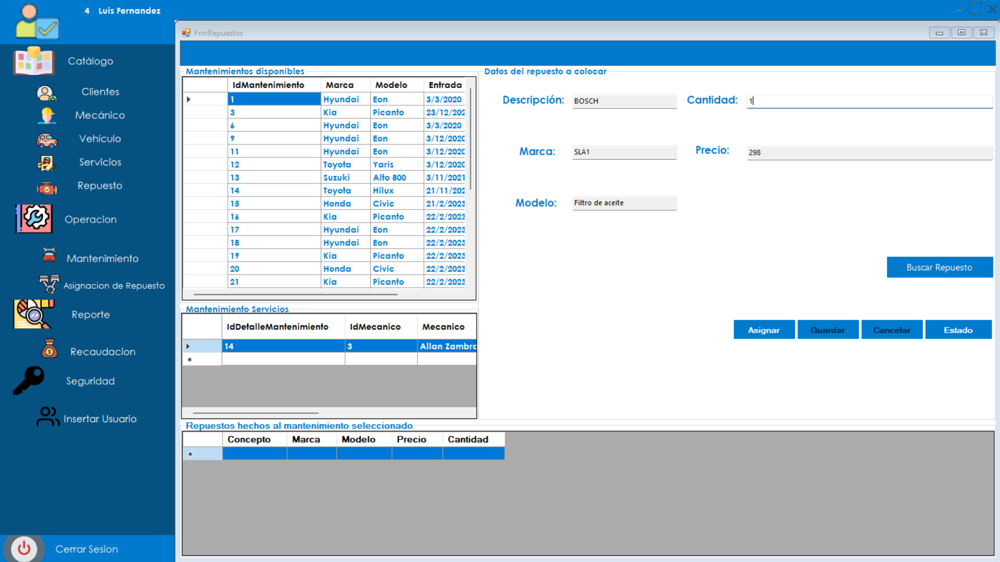
### Reportes exportados en Power BI
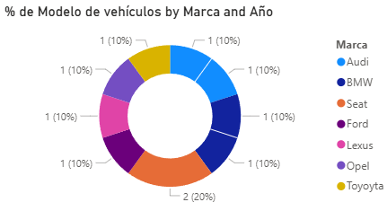

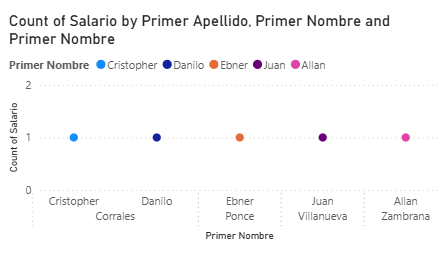

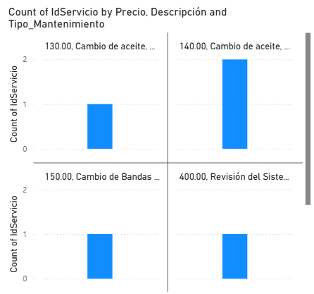

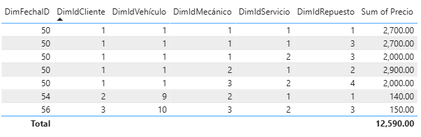

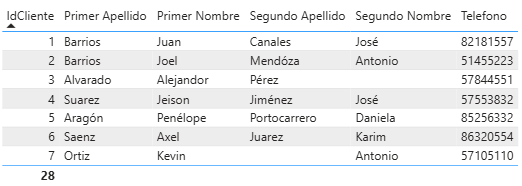

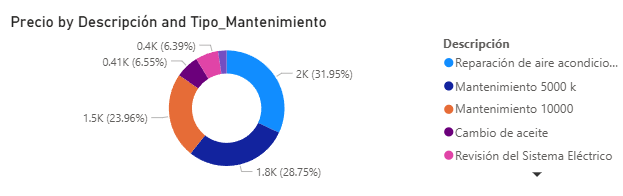
